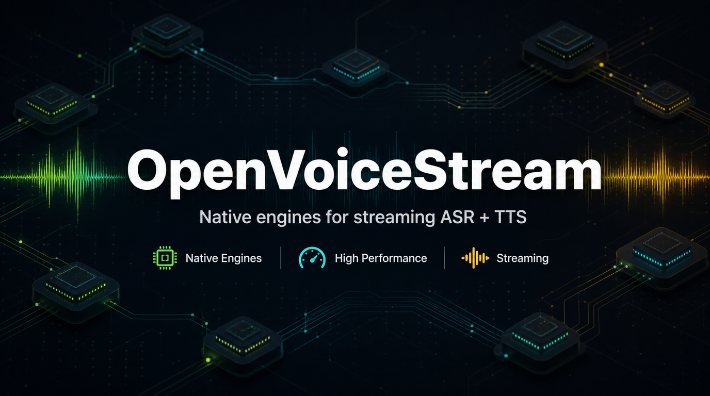

# Jetson Voice

**~110ms ASR + TTS on edge devices — GPU-accelerated voice stack powered by [sherpa-onnx](https://github.com/k2-fsa/sherpa-onnx), zero cloud dependency.**

[](https://github.com/k2-fsa/sherpa-onnx)
[](https://www.docker.com/)
[](https://developer.nvidia.com/embedded-computing)
[](LICENSE)

<p align="center">
  
</p>

Turn any CUDA device into a local voice server. Speak into it, get text back in 50ms. Send text, get speech in 60ms. No cloud, no API keys, no internet needed.

Jetson Voice wraps [sherpa-onnx](https://github.com/k2-fsa/sherpa-onnx) models in a FastAPI service with HTTP and WebSocket endpoints — deploy with one `docker compose up`. Two language modes: **Chinese+English** (Paraformer + Matcha-TTS) and **English-only** (Zipformer + Kokoro TTS), switchable via `LANGUAGE_MODE` env var.

### Latency (Jetson Orin NX 16GB, CUDA 12.6, MAXN)

**Chinese + English mode** (`LANGUAGE_MODE=zh_en`, default):

| Stage | Model | Latency | Note |
|-------|-------|---------|------|
| **ASR** | Paraformer zh+en (streaming) | ~50ms TTFT | Real-time partial results via WebSocket |
| **TTS** | Matcha-TTS + Vocos zh+en (streaming) | ~60ms TTFT | Best Chinese quality, streaming PCM |

**English-only mode** (`LANGUAGE_MODE=en`):

| Stage | Model | Latency | Note |
|-------|-------|---------|------|
| **ASR** | Zipformer en (streaming) | ~50ms TTFT | Transducer model, English optimized |
| **TTS** | Kokoro v1.0 en (streaming) | ~130ms TTFT | 53 speakers, high English quality |

| Stage | Model | Latency | Note |
|-------|-------|---------|------|
| ASR (fallback) | SenseVoice 5-lang | ~200ms | Batch mode, offline, lazy-loaded (both modes) |

ASR + TTS combined: **~110ms** (zh_en) / **~180ms** (en). Full voice-to-voice latency depends on LLM inference time (not included here).

## Table of Contents

- [Quick Start](#quick-start)
- [Architecture](#architecture)
- [Services](#services)
- [API Reference](#api-reference)
- [Performance](#performance)
- [Configuration](#configuration)
- [Patched sherpa-onnx](#patched-sherpa-onnx)
- [Requirements](#requirements)
- [Project Structure](#project-structure)
- [Acknowledgements](#acknowledgements)

## Quick Start

### Option 1: Pre-built Image (Recommended)

Pull and run the pre-built image. Models are auto-downloaded on first start (~1 min) and cached in a volume:

```bash
# Chinese + English (default)
docker run -d --name jetson-voice \
  --runtime nvidia --ipc host \
  -p 8621:8000 \
  -v jetson-voice-models:/opt/models \
  --restart unless-stopped \
  sensecraft-missionpack.seeed.cn/solution/jetson-voice:v1.0

# First start downloads models (~930 MB), then ~40s warmup
curl http://localhost:8621/health
# {"asr":false,"tts":true,"streaming_asr":true}
```

**English-only mode** (Kokoro TTS + Zipformer ASR, ~980 MB):

```bash
docker run -d --name jetson-voice \
  --runtime nvidia --ipc host \
  -p 8621:8000 \
  -e LANGUAGE_MODE=en \
  -e TTS_DEFAULT_SID=3 \
  -v jetson-voice-models:/opt/models \
  --restart unless-stopped \
  sensecraft-missionpack.seeed.cn/solution/jetson-voice:v1.0
```

### Option 2: Build from Source

```bash
git clone https://github.com/Seeed-Projects/jetson-voice.git
cd jetson-voice

# Build & run
docker compose build
docker compose up -d

# Verify
curl http://localhost:8000/health
# {"asr":true,"tts":true,"streaming_asr":true}
```

Models (~1.5 GB total) are auto-downloaded on first start.

## Architecture

```text
┌───────────────────────────────────────────────────────────┐
│  Jetson Orin NX (CUDA 12.6)                               │
│                                                           │
│  FastAPI service (:8000)                                  │
│  ├── WS /asr/stream    Streaming ASR                      │
│  │     └─ zh_en: Paraformer  │  en: Zipformer             │
│  ├── POST /asr          SenseVoice offline ASR (both)     │
│  ├── POST /tts          Batch TTS                         │
│  └── POST /tts/stream   Streaming TTS                     │
│        └─ zh_en: Matcha-TTS  │  en: Kokoro                │
│                                                           │
│  sherpa-onnx + ONNX Runtime 1.20 (CUDA)                   │
└───────────────────────────────────────────────────────────┘
         ▲ HTTP/WebSocket
         │
   Any client (SBC, laptop, robot, ...)
```

The service is model-agnostic at the API level — clients send audio/text, get audio/text back. Swap models without changing client code.

## Services

Models are selected automatically based on `LANGUAGE_MODE`:

| Service | Endpoint | zh_en (default) | en | Protocol |
|---------|----------|-----------------|-----|----------|
| **Streaming ASR** | `WS /asr/stream` | Paraformer bilingual | Zipformer English | WebSocket: int16 PCM in, JSON out |
| **Streaming TTS** | `POST /tts/stream` | Matcha-TTS + Vocos | Kokoro v1.0 (53 speakers) | HTTP: JSON in, raw PCM stream |
| **Batch TTS** | `POST /tts` | Matcha-TTS + Vocos | Kokoro v1.0 | HTTP: JSON in, WAV out |
| Offline ASR | `POST /asr` | SenseVoice (zh+en+ja+ko+yue) | SenseVoice (same) | HTTP: WAV upload, JSON out |

## API Reference

### Streaming ASR (WebSocket)

```text
WS /asr/stream?sample_rate=16000&language=auto
```

- Client sends: raw **int16 PCM bytes** (audio chunks, e.g. 100ms each)
- Client sends: **empty bytes** `b""` to signal end of audio
- Server sends: JSON `{"text": "...", "is_final": bool, "is_stable": bool}`

```python
import asyncio, websockets

async def transcribe():
    async with websockets.connect("ws://jetson:8000/asr/stream?sample_rate=16000") as ws:
        for chunk in audio_chunks:  # np.int16 arrays
            await ws.send(chunk.tobytes())
            result = await ws.recv()  # partial results
        await ws.send(b"")  # signal end
        final = await ws.recv()  # {"text": "...", "is_final": true}
```

### Offline ASR (HTTP)

```bash
curl -X POST http://jetson:8000/asr \
  -F "file=@recording.wav" -F "language=auto"
# {"text": "transcribed text"}
```

### TTS (HTTP)

```bash
curl -X POST http://jetson:8000/tts \
  -H "Content-Type: application/json" \
  -d '{"text": "Hello world", "sid": 3, "speed": 1.2}' \
  --output output.wav
```

Parameters: `text` (required), `sid` (speaker ID, default 3), `speed` (rate, default 1.0)

### TTS Streaming (HTTP)

Returns raw PCM: first 4 bytes = sample rate (uint32 LE), then int16 samples.

```text
POST /tts/stream
Content-Type: application/json
```

### Health Check

```text
GET /health  →  {"asr": bool, "tts": bool, "streaming_asr": bool}
```

## Performance

### Benchmarks (Jetson Orin NX 16GB, CUDA 12.6, MAXN mode)

**zh_en mode:**

| Metric | Value |
|--------|-------|
| Paraformer TTFT | ~50ms |
| Paraformer finalize | ~45ms |
| Paraformer accuracy | 80.8% (26 synthetic sentences) |
| Matcha TTS TTFT | ~60ms (short text) |
| Matcha TTS latency | ~150ms (typical Chinese sentence) |

**en mode:**

| Metric | Value |
|--------|-------|
| Zipformer TTFT | ~50ms |
| Kokoro TTS TTFT | ~130ms (short text) |
| Kokoro TTS latency | ~300ms (typical sentence) |

### TTS Model Comparison

We evaluated 4 TTS models for TTFT (time-to-first-audio-chunk). Matcha-TTS was selected for zh_en mode (best Chinese quality), Kokoro for en mode (best English quality):

| Model | TTFT (short) | TTFT (long) | Chinese Quality | English Quality | Used in |
|-------|-------------|-------------|-----------------|-----------------|---------|
| **Matcha-TTS + Vocos** | ~60ms | ~150ms | Good | Fair | **zh_en** |
| **Kokoro v1.0** | ~130ms | ~300ms | — | Excellent | **en** |
| CosyVoice3 | ~800ms | ~2s | Excellent | — | — |
| F5-TTS | ~2.5s | ~5s | Excellent | — | — |

Benchmark scripts are in `benchmarks/`. See `benchmarks/archive/` for detailed F5-TTS optimization experiments (CUDA, TensorRT, NFE sweep).

### Performance Tuning

Run once after boot to lock clocks to max:

```bash
sudo ./setup-performance.sh
```

This sets MAXN power mode, locks CPU/GPU clocks, and disables dynamic frequency scaling. Critical for consistent inference latency.

## Configuration

### Environment Variables

| Variable | Default | Description |
|----------|---------|-------------|
| `LANGUAGE_MODE` | `zh_en` | `zh_en` (Chinese+English) or `en` (English only) |
| `TTS_PROVIDER` | `cuda` | ONNX execution provider |
| `TTS_DEFAULT_SID` | `3` | Default TTS speaker ID |
| `TTS_NUM_THREADS` | `4` | TTS inference threads |
| `TTS_PITCH_SHIFT` | `0` | Pitch shift in semitones (e.g. `2` = higher, `-2` = lower) |
| `SENSEVOICE_LANGUAGE` | `auto` | SenseVoice language hint |
| `STREAMING_ASR_PROVIDER` | `cuda` | Paraformer execution provider |
| `MODEL_DIR` | `/opt/models` | Model storage directory |

Copy `.env.example` to `.env` to customize.

### Models

Auto-downloaded on first start via `scripts/download_models.sh`:

| Model | Size | Mode | Purpose |
|-------|------|------|---------|
| Paraformer streaming zh-en | ~230 MB | `zh_en` | Streaming ASR (bilingual) |
| Matcha-TTS + Vocos zh-en | ~125 MB | `zh_en` | TTS synthesis |
| Zipformer streaming en | ~65 MB | `en` | Streaming ASR (English only) |
| Kokoro TTS v1.0 | ~719 MB | `en` | TTS synthesis (English, 53 speakers) |
| SenseVoice zh-en-ja-ko-yue | ~500 MB | both | Offline ASR (5 languages) |

## Patched sherpa-onnx

Includes a patched sherpa-onnx that fixes Paraformer streaming tail truncation (stock version drops the last 1-3 characters). The patch:

1. **IsReady()** — forces decode of remaining frames after `InputFinished()`
2. **DecodeStream()** — zero-pads partial final chunks
3. **CIF force-fire** — emits residual tokens at end-of-stream

Pre-built `.so` files in `patches/sherpa-onnx-lib/` (aarch64, Python 3.10, CUDA 12.6).
See `patches/README.md` for rebuild instructions.

## Requirements

- Jetson Orin NX 16GB (JetPack 6.2, CUDA 12.6) — or any CUDA-capable device with Docker
- Docker with `nvidia` runtime
- ~5 GB disk for models

## Project Structure

```text
jetson-local-voice/
├── app/                     # FastAPI service
│   ├── main.py              # Endpoints and startup
│   ├── asr_service.py       # SenseVoice offline ASR
│   ├── streaming_asr_service.py  # Paraformer streaming ASR
│   ├── tts_service.py       # Matcha TTS (batch + streaming)
│   └── vc_service.py        # Voice conversion (experimental)
├── benchmarks/              # TTS model TTFT comparisons
│   ├── test_f5tts_ttft.py   # F5-TTS vs Kokoro TTFT
│   ├── test_matcha_ttft.py  # Matcha vs Kokoro TTFT
│   ├── test_cosyvoice3_ttft.py  # CosyVoice3 per-stage timing
│   └── archive/             # Detailed F5-TTS optimization experiments
├── patches/                 # Paraformer EOF truncation fix
├── scripts/                 # Model download, ORT patching
├── Dockerfile               # Multi-stage build for JetPack 6.2
├── docker-compose.yml       # nvidia runtime, GPU, model volume
└── setup-performance.sh     # Jetson clock/power tuning
```

## Acknowledgements

- [sherpa-onnx](https://github.com/k2-fsa/sherpa-onnx) — speech inference engine powering all ASR and TTS models
- [next-gen Kaldi](https://github.com/k2-fsa) — the research foundation behind sherpa-onnx
- [Paraformer](https://github.com/modelscope/FunASR) — streaming bilingual ASR model
- [Matcha-TTS](https://github.com/shivammehta25/Matcha-TTS) — fast flow-matching TTS (zh+en mode)
- [Kokoro](https://huggingface.co/hexgrad/Kokoro-82M) — high-quality English TTS with 53 speakers (en mode)
- [Zipformer](https://github.com/k2-fsa/icefall) — efficient transducer ASR (en mode)
- [SenseVoice](https://github.com/FunAudioLLM/SenseVoice) — multilingual offline ASR
